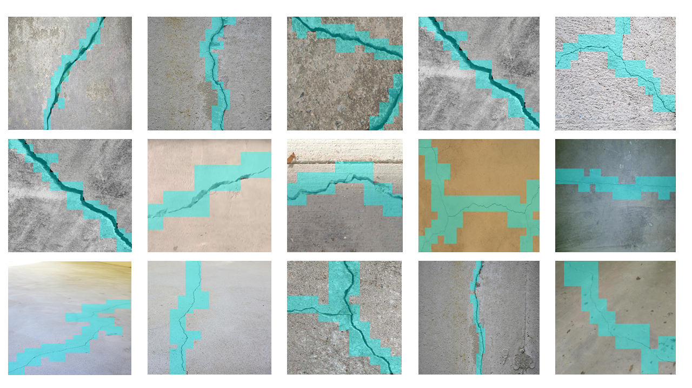
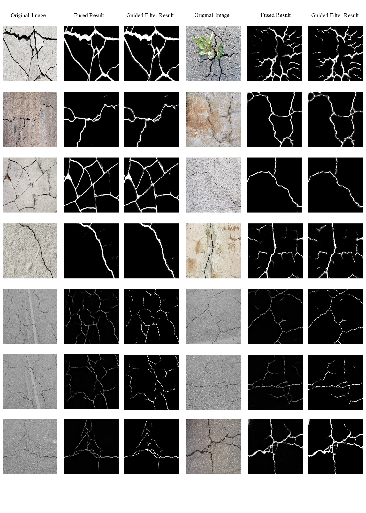

# Crack-Detection-and-Segmentation-Dataset-for-UAV-Inspections
Here I have summarized different crack datasets and constructed a benchmark dataset for crack detection and segmentation. And this is the dataset that can be utilized for both crack detection and segmentation and it will be beneficial for further research in this field. Comprehensive and versatile infrastructural crack types are supported in the dataset, including the pavements, bridges, and buildings cracks. The dataset for crack segmentation contains 11,298 crack images annotated with fine-grained pixel-level labels. It can also be used as the source dataset in performing unsupervised domain adaptive crack segmentation because of its comprehensive and versatile property. 
# Contents
 - [Overview](#Overview)
 - [Dataset Download](#Dataset)
 - [Results](#Results)
 - [Citation](#Citation)
 
 # Overview
Concrete structures such as bridges play an important role in ground transportation networks. While it is very labor-intensive and dangerous for a human to do the crack inspection. However, traditionally, concrete structure inspections are conducted manually by human operators with heavy and expensive mechanical equipment. It is logistically challenging, costly, and dangerous, especially when inspecting the substructure and superstructure in harsh environments that are hard and dangerous to be accessed by human operators. Therefore, it is very meaningful and significant for us to develop a fully autonomous intelligent unmanned aerial system for inspecting large-scale concrete structures and detecting the defects such as cracks. Most importantly, a significant module for the UAV intelligent inspection system is to develop computer vision algorithms for processing images captured and detecting cracks and structural damages.
 
 # Dataset Downloading
We have established a benchmark dataset comprising various crack types, including the pavements, bridges, and buildings cracks. We have summarized different crack detection and segmentation datasets and established a benchmark dataset. The link is as follows and feel free to download it.
 
When you are doing training based on the provided dataset, feel free to do the pre-processing such as cropping, resizing, rotating, normalizing, and fliping to preprocess and enhance the dataset as the requirement.
You can download the dataset from [the link](https://drive.google.com/open?id=1RMf0GYXn7Mq1s9STGFG5iByavTr05SjF).
# Results
The randomly selected crack detection results of the sliding window approach are shown as follows:

Some results using feature pyramid-based convolutional neural networks to do segmentation are shown below. The Guided Filter is utilized to do the post-processing.

Following are some typical detection results in some challenging circumstances with various cracks and noises.

Comprehensive and versatile infrastructural crack types are supported in the dataset, including the pavements, bridges, and buildings cracks. When solving the problem of domain adaptive crack recognition, the proposed database can be regarded as the source dataset with labels. And using unsupervised domain adaptive recognition methods, the trained model can be transferred to the unlabelled test set with a great performance. Also, unsupervised domain adaptation is a very significant research topic about how to improve the generalization and domain adaptation capacity of current deep learning frameworks for practical visual recognition applications.
